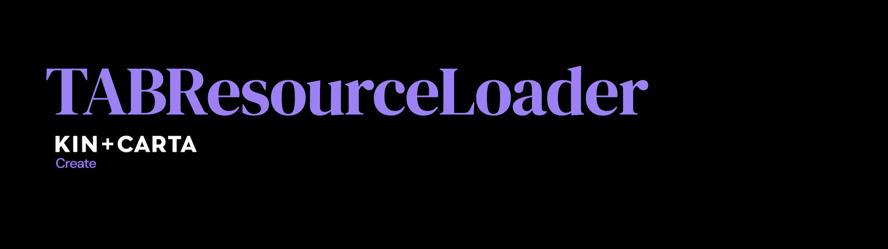

# TABResourceLoader

This library is designed to fetch resources in a consistent and modular way. The user can define resources by conforming to protocols that define where and how to get them. These resources can then be retrieved using a generic service type with or without an operation provided by the library. By following this approach it's easy to have testable and modular networking stack.

## Example use cases

### Working with a web service

- [Retrieving a JSON object](Documentation/RetrievingJSONObjectExample.md)
- [Retrieving an image](Documentation/RetrievingImageExample.md)
- [Responding to network activity](Documentation/RespondingToNetworkActivity.md)
- [Using failure model example](Documentation/Using failure models.md)

## High level architecture

This library defines/uses 4 concepts: model, resource, service and operation:

1. **Model**: Strongly typed object in your codebase, may or may not be mapped 121 to the server model
2. **Resource**: Defines through protocol conformance *where* and *how* to fetch a **Model**. For example a resource could define the URL of where a JSON file is and how to parse into strongly types model.
3. **Service**: A type that knows how to retrieve a specific kind of **Resource**
4. **Operation**: Provides a concurrency model when using a **Service**. Useful when implementing custom business logic such as throttling of fetches.

## Resource protocols

### Root protocols

- `ResourceType`: Defines a generic `Model`
- `NetworkResourceType`: Defines how an endpoint can be accessed. Using specifying the following properties:
	- **URL** *(Required)* 
	- **HTTP method** *(Optional, default GET)* 
	- **HTTP header fields** *(Optional)* 
	- **Body of request (JSON encoded)** *(Optional)* 
	- **URL query strings** *(Optional)* 

### Conforming to `ResourceType`

- `DataResourceType`: Defines a resource that can create a generic `Model` from `(NS)Data`

### Conforming to `DataResourceType`

- `JSONDictionaryResourceType`: Defines the transformation from a JSON object, i.e. `[String: Any]` to a generic `Model`
- `JSONArrayResourceType `: Defines the transformation from a JSON array, i.e. `[Any]` to a generic `Model`
- `ImageResourceType`: Defines the transformation from `(NS)Data` to a `UIImage`

### Protocols that inherit from multiple protocols

- `NetworkJSONDictionaryResourceType`: Combines `JSONDictionaryResourceType` and `NetworkResourceType` to allow for retrieving a generic `Model` from a JSON dictionary from a web service.
- `NetworkJSONArrayResourceType`: Combines `JSONArrayResourceType` and `NetworkResourceType` to allow for retrieving a generic `Model` from a JSON array from a web service.

Note: Both include `["Content-Type": "application/json"]` as default header fields. 

### Concrete types

- `NetworkImageResource`: Conforms to `ImageResourceType` and can be initialized with a `URL`

## Services

- `NetworkDataResourceService`: Used to retrieve a resource that conforms to `NetworkResourceType` and `DataResourceType`
	- `fetch` function returns a `Cancellable` object which can be used to cancel the network request
	- When the network request finishes a completion handler is called with a `NetworkResponse<Model>` enum
- `GenericNetworkDataResourceService`: Inherits `NetworkDataResourceService` and conforms to`ResourceServiceType`. The purpose of this service is to be use with `ResourceOperation`

## ResourceOperation

- Uses a service that conforms to `ResourceServiceType` to retrieve a resource that conforms to `ResourceType`
- Subclass of `(NS)Operation` used to retrieve a resource with specific service
- Uses a completion handler when the operation is finished to pass it's `Result`

## Contributing

Guidelines for contributing can be found [here](CONTRIBUTING.md).

## Author

Luciano Marisi [@lucianomarisi](http://twitter.com/lucianomarisi)

**The original idea for this pattern is explained on [Protocol oriented loading of resources from a network service in Swift](http://www.marisibrothers.com/2016/07/protocol-oriented-loading-of-resources.html)**

## License

TABResourceLoader is available under the MIT license. See the LICENSE file for more info.